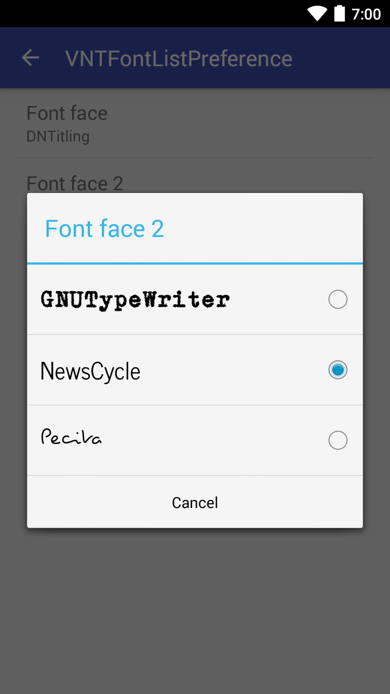

VNTFontListPreference
=====================

This custom preference opens a dialog of available fonts and automatically saves a selected font. The font directory and defaultValue is fully customizable.

```xml
<com.vanniktech.vntfontlistpreference.VNTFontListPreference
    android:defaultValue="@string/font_face_default_value"
    android:key="preference_font_face"
    android:title="@string/font_face"
    app:vnt_fontDirectory="@string/font_face_font_directory" />
```

`vntfontlistpreference:vnt_fontDirectory` will list all fonts ending in `ttf` or `otf` under `assets/fonts`, similar to `fonts`. If there are no fonts under the provided directory it will throw an exception during initialization.

# Download Sample App

[](https://play.google.com/store/apps/details?id=com.vanniktech.vntfontlistpreference.sample)

or scan the code on your mobile


or download it [directly](sample.apk)

# Setup

**build.gradle**

```groovy
compile 'com.vanniktech:vntfontlistpreference:1.0.0'
compile 'com.vanniktech:vntfontlistpreference:1.0.1-SNAPSHOT'
```

Modules are located on [Maven Central](https://oss.sonatype.org/#nexus-search;quick~vntfontlistpreference).

Go to your preference XML file and insert the above mentioned XML tag. Afterwards you are good to go and can run your project!

# Get default font

```java
final SharedPreferences sharedPreferences = PreferenceManager.getDefaultSharedPreferences(this);
final String defaultFont = sharedPreferences.getString("preference_font_face", this.getString(R.string.font_face_default_value));
final Typeface typeface = Typeface.createFromAsset(this.getAssets(), font);
```

# Proguard

No configuration needed.

# Preview



# License

Copyright (C) 2014-2016 Vanniktech - Niklas Baudy

Licensed under the Apache License, Version 2.0
