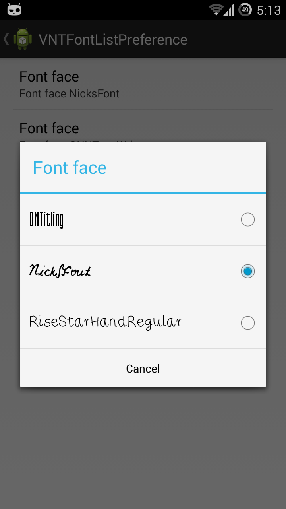

VNTFontListPreference
=====================

[](https://travis-ci.org/vanniktech/VNTFontListPreference)
[](https://android-arsenal.com/api?level=14)
[](http://www.apache.org/licenses/LICENSE-2.0.html)
[](https://android-arsenal.com/details/1/798)
[](https://jitpack.io/#vanniktech/VNTFontListPreference)
[](http://androidweekly.net/issues/issue-111)

This is an easy to use custom preference, which opens a dialog with a list of available fonts. The selected font gets automatically saved and you are able to set the font directory as well as the defaultValue.

```xml
<com.vanniktech.vntfontlistpreference.VNTFontListPreference
    xmlns:vntfontlistpreference="http://schemas.android.com/apk/res-auto"
    android:defaultValue="@string/font_face_default_value"
    android:key="preference_font_face"
    android:title="@string/font_face"
    vntfontlistpreference:fontDirectory="@string/font_face_font_directory" />
```

`vntfontlistpreference:fontDirectory` can be something like `fonts`. This means that the dialog will list all fonts, that have the ending `ttf` or `otf` under `assets/fonts`. Also please make sure that you don't have a slash at the end of the fontDirectory configuration. If there are no fonts under the provided directory it will throw an exception during initialization.

# Download

[](https://play.google.com/store/apps/details?id=com.vanniktech.vntfontlistpreference.sample)

or scan the code on your mobile


or download it [directly](sample.apk)

# Setup

**build.gradle**

```groovy
repositories {
    maven { url "https://oss.sonatype.org/content/repositories/snapshots/" }
}

dependencies {
    compile 'com.vanniktech:vntfontlistpreference:0.1.2-SNAPSHOT'
}
```

Go to your preference XML file and insert the above mentioned XML tag. Afterwards you are good to go and can run your project!

# Get default font

```java
final SharedPreferences sharedPreferences = PreferenceManager.getDefaultSharedPreferences(this);
final String defaultFont = sharedPreferences.getString("preference_font_face", this.getString(R.string.font_face_default_value));
final Typeface typeface = Typeface.createFromAsset(this.getAssets(), font);
```

# Preview



# License

Copyright (C) 2014-2015 Vanniktech - Niklas Baudy

Licensed under the Apache License, Version 2.0